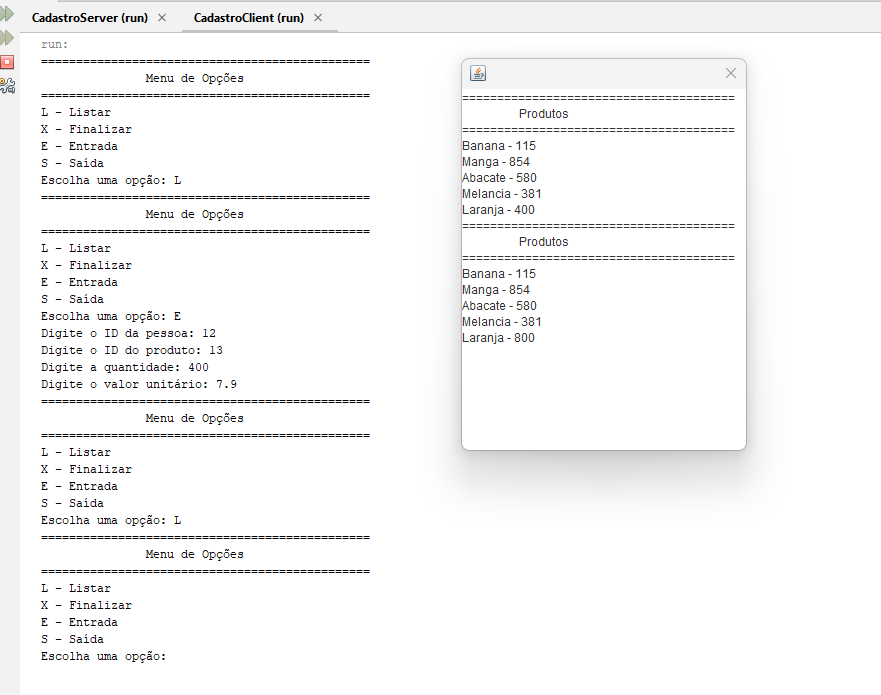

## CadastroServerClient
Criação de servidores e clientes baseados em Socket, com uso de Threads tanto no lado cliente quanto no lado servidor, acessando o banco de dados via JPA.

### Tela da Aplicação

### Versão do Software

* SQL Server Management Studio 19
* Microsoft SQL Server Express 2022
* NetBeans 18
* JDK 8

### Arquivos

* O arquivo **Loja.bak** contém uma cópia do banco utilizado. 
* O arquivo **RelatorioPratica.pdf** contém informações e análise sobre os procedimentos executados.
* Diretório **CadastroClient** aplicação Cliente.
* Diretório **CadastroServer** aplicação Servidor.

